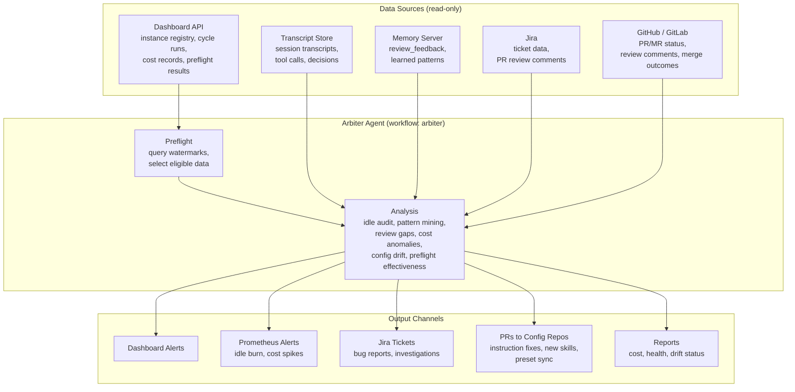

# Arbiter Agent Design

A meta-agent that audits, analyzes, and improves all Rehor agent instances. It reads telemetry (cycles, transcripts, PRs, costs, memories) across the fleet and produces actionable improvements — PRs to config repos, new skills, instruction fixes, Jira tickets, and dashboard alerts.

---

## Problem

Rehor runs 13+ agent instances across 9 teams. Each instance generates rich signal — cycle runs, transcripts, PRs/MRs, cost records, review feedback, memories. Today nobody systematically mines this data:

- **Token waste goes unnoticed.** An instance burning tokens on idle cycles (preflight passes but no real work exists) runs for days before a human spots it. Could be a stale schedule, a preflight bug, or a misconfigured board filter.
- **Repetitive patterns stay manual.** Agents perform the same multi-step tool call sequences across instances. These could be extracted into reusable skills but nobody reviews transcripts looking for them.
- **Review feedback doesn't propagate.** When a reviewer corrects an agent's PR, that correction lives in one instance's `review_feedback` memory. If 5 reviewers across 3 instances say "don't use deprecated API X," nobody aggregates that into a platform-level instruction fix.
- **Repo setup gaps are invisible.** Missing CLAUDE.md sections, absent test commands, stale agent config — these cause agent confusion that shows up as wasted cycles and bad PRs, but the root cause isn't surfaced.
- **No cross-instance learning.** A fix discovered for one instance (a skill, an instruction, a preflight check) could benefit others on similar repos but there's no mechanism to propagate it.

---

## Goals

1. **Reduce cost** — detect and eliminate token waste from idle cycles, bad preflight, model mismatches, and stale instances
2. **Improve quality** — surface instruction gaps, repo setup issues, and recurring review corrections before they cost more cycles
3. **Extract skills** — mine transcripts for repetitive tool call patterns and generate reusable skills
4. **Propagate learning** — spread improvements discovered in one instance across the fleet where applicable
5. **Maintain accountability** — all arbiter actions are tracked, auditable, and require human approval for changes

---

## What the Arbiter Does

### 1. Idle Cycle Auditor

Detect instances burning tokens without producing useful output.

**Inputs:** Cycle run records (type, duration, token usage, outcome), preflight results, instance schedules.

**Detects:**
- Cycles where preflight passes but the agent concludes "nothing to do" (preflight gap)
- Cycles with high token usage but no PR opened, no commit pushed, no ticket transitioned
- Instances with sustained idle patterns (>N consecutive idle cycles)
- Sudden cost spikes — instance costs 3x its rolling average

**Outputs:**
- Dashboard alert with diagnosis (stale schedule, preflight bug, board filter misconfiguration, bad ticket quality)
- Prometheus alert for critical cases — sustained idle cycles with token burn, cost spikes exceeding threshold. These fire independently of the arbiter's own schedule so on-call gets notified in real time, not on the next daily arbiter run. Depends on Prometheus integration work currently in progress.
- Jira ticket if the root cause is a fixable bug
- Recommendation: adjust schedule, fix preflight, pause instance, or investigate

### 2. Transcript Pattern Miner

Analyze agent transcripts to find repetitive tool call sequences that should become skills.

**Inputs:** Session transcripts across all instances (tool calls, arguments, sequences).

**Detects:**
- Repeated multi-step tool call sequences (≥3 steps appearing in ≥3 transcripts)
- Common file read/edit patterns tied to specific repo structures
- Boilerplate generation patterns (test files, config files, PR descriptions)

**Outputs:**
- GitHub issue on the instance config repo with the candidate skill definition, generic usage pattern description, and estimated frequency/savings. No sensitive data — no transcript excerpts, no file paths from target repos, no tool call arguments. Only the abstract pattern and the proposed skill structure.
- PR to core repo or instance config repo with the new skill (after team acknowledges the issue)
- Frequency and cost data showing how much the skill would save (aggregated numbers only — "pattern seen N times across M cycles, estimated saving X tokens per occurrence")

### 3. PR/MR Review Gap Analyzer

Mine PR review comments and outcomes to find instruction and repo setup gaps.

**Inputs:** PR/MR review comments, merge/reject outcomes, `review_feedback` memories across instances.

**Detects:**
- Recurring reviewer corrections (same feedback appearing across multiple PRs/instances)
- High rejection rate for specific types of changes
- Missing or outdated CLAUDE.md instructions causing predictable agent errors
- Repo setup issues: missing test commands, absent linting config, stale CI definitions
- PRs with unusually high comment count — signals a gap upstream. Common causes: underspecified Jira ticket (missing acceptance criteria, vague requirements), bad repo context (missing or outdated CLAUDE.md, no AGENTS.md), stale/misleading memories in the memory server causing wrong assumptions, or bad task tracking (agent re-doing work already done, addressing already-resolved feedback, working on stale ticket state)

**Outputs:**
- PR to instance config repo updating CLAUDE.md instructions
- PR to target repo adding missing scaffolding (test commands, CLAUDE.md sections)
- Aggregated report of most common review corrections fleet-wide

### 4. Cost Anomaly Detector

Spot unusual cost patterns across the fleet.

**Inputs:** Cost records per instance, per model, per cycle.

**Detects:**
- Instance cost deviating >2σ from rolling 7-day average
- Model usage mismatches (instance using Opus for work that could run on Sonnet/Haiku)
- Cycles with disproportionate token usage relative to output (high input, low output = confused agent)
- Sub-task model opportunities — tasks within a cycle that don't need the main model. CVE triage, dependency bumps, label management, and other non-coding tasks could run on cheaper models (Haiku) or non-Claude models entirely (Gemini, local models). Coding tasks with narrow scope (single-file fixes, test generation) could use sub-agents on a lighter tier while the main agent orchestrates.

**Outputs:**
- Dashboard cost anomaly alerts with instance, timeframe, and magnitude
- Model routing recommendations — per-instance ("instance X does simple label work, switch to Haiku") and per-task-type ("CVE triage across all instances could use Gemini, saving ~Y tokens/cycle"). Feeds into the model customization & cost tiering roadmap item (§6).
- Jira ticket for investigation if anomaly persists

### 5. Config Drift & Staleness Detector

Detect instance config repos that diverged from core presets or are running outdated versions.

**Note:** Basic instance health (pod liveness, cycle count, memory store size, stale schedules) belongs in Prometheus — metrics exported directly from agent pods and the dashboard, not requiring an LLM. The arbiter handles what Prometheus can't: semantic analysis of config drift and outdated instructions that require understanding the content, not just counting.

**Inputs:** Instance config repos (CLAUDE.md, workflow config, skills, preflight scripts), core preset repo state, instance registration metadata (REHOR-53).

**Detects:**
- Config repos that diverged from core presets — missing new features, outdated workflow version, stale skill definitions
- Instances running old preset versions when newer versions fix known issues
- CLAUDE.md instructions that contradict current core recommendations
- Missing adoption of new preflight checks or skills shipped in core

**Outputs:**
- GitHub issue on instance config repo listing what's outdated and what the current version provides (generic, no sensitive data)
- PR to config repo to sync with latest preset version (after team acknowledges)
- Dashboard report showing drift status per instance

**Not in scope (Prometheus instead):**
- Pod health, restart counts, scheduling issues
- Cycle count and activity metrics
- Memory store size and growth rate
- Stale instance detection (no cycles in >N days)

### 6. Cross-Instance Learning

Propagate improvements discovered in one instance to others where applicable.

**Inputs:** Skills, instructions, preflight checks across all instance config repos. Transcript analysis results.

**Detects:**
- Skill created for instance A that would benefit instances B, C (similar repos, similar workflows)
- Instruction fix in one config repo that addresses a pattern seen in other instances' transcripts
- Preflight check added to one instance that would prevent waste seen in others

**Outputs:**
- PR to other instance config repos with the proposed improvement
- Report showing which instances would benefit and estimated savings

### 7. Preflight Effectiveness Audit

Evaluate whether preflight checks are actually saving tokens.

**Inputs:** Preflight results (start/skip decisions), subsequent cycle outcomes when started.

**Detects:**
- Preflight checks that never trigger (dead code)
- Preflight checks that always trigger (too permissive — not filtering enough)
- Cycles that preflight approved but produced no useful output (gap in checks)
- Preflight scripts with high execution time relative to value

**Outputs:**
- Report on preflight effectiveness per check, per instance
- PR to add missing checks or remove dead ones
- Recommendations for new checks based on observed idle patterns

---

## Architecture

### Deployment

The arbiter runs as its own Rehor instance with a dedicated workflow (`arbiter`). It uses the same infrastructure — same proxy, same memory server, same dashboard registration — but with elevated read access to fleet-wide data.



### Data Access

The arbiter needs read access to:

| Data Source | What | Access Method |
|---|---|---|
| Dashboard API | Instance registry, cycle runs, cost records, preflight results | REST API with service account |
| Transcript store | Full session transcripts (tool calls, responses, decisions) | Memory server (fleet-scoped read via memory MCP) |
| Memory server | Instance memories (`review_feedback`, learned patterns) | Memory MCP (read-only) |
| Instance config repos | CLAUDE.md, workflow config, skills, preflight scripts | Git clone via proxy |
| Target repos | CLAUDE.md, test setup, CI config | Git clone via proxy (read-only) |
| Jira | PR review comments, ticket data | Jira MCP |
| GitHub/GitLab | PR/MR status, review comments, merge outcomes | GitHub/GitLab API via proxy |

### Access Control

Arbiter data is privileged — transcripts contain reasoning, tool arguments, and potentially sensitive context from target repos. Not all agents should see this.

**Network-level enforcement (NetworkPolicy).** Fleet-wide data (transcripts, cycle records, cost data, cross-instance memories) is served on dedicated ports. OpenShift NetworkPolicy restricts those ports to pods with the `app=arbiter` label. Regular agent pods physically cannot reach fleet-wide endpoints — blocked at the kernel, no application code involved.

```yaml
# Example: memory server fleet-read port restricted to arbiter
apiVersion: networking.k8s.io/v1
kind: NetworkPolicy
metadata:
  name: memory-server-fleet-read
spec:
  podSelector:
    matchLabels:
      app: memory-server
  ingress:
    - from:
        - podSelector:
            matchLabels:
              app: arbiter
      ports:
        - port: 5433    # fleet-wide read
          protocol: TCP
    - from:
        - podSelector:
            matchLabels:
              role: agent
      ports:
        - port: 5432    # instance-scoped read/write
          protocol: TCP
```

Same pattern applies to dashboard API (fleet query port) and transcript store. Each service exposes two ports: one instance-scoped (open to all agents), one fleet-scoped (arbiter only).

**ServiceAccount identity check.** Dashboard sits behind the cluster auth proxy (SSO). Auth proxy sets `X-Forwarded-User` with the caller's ServiceAccount identity (e.g., `system:serviceaccount:<namespace>:arbiter`). Dashboard checks SA name — only the `arbiter` SA gets fleet endpoint access. No custom OAuth scopes needed — SA identity is the scope. Belt and suspenders with NetworkPolicy: network blocks unauthorized pods, SA identity blocks unauthorized requests even from permitted pods.

**Config repo access.** The arbiter's own config repo is restricted — only platform maintainers can modify its instructions.

**What the arbiter must NOT do:**
- Write directly to other instances' memory stores
- Push to instance config repos without PR (always PR, always human-approved)
- Access secrets or credentials beyond its own proxy routing
- Modify its own instructions or preflight checks

### State Tracking

The arbiter must not re-analyze the same data repeatedly. It tracks progress using **tasks** (operational state) and stores learnings in **memories** (knowledge).

**Watermarks via tasks.** Each watermark is a task record — not a memory. Tasks are operational cursors, not knowledge. The arbiter's preflight reads task watermarks to determine what's new since last run.

| Source | Watermark (stored as task) |
|---|---|
| Cycle runs | Last processed `cycle_id` per instance |
| Transcripts | Last processed `transcript_id` per instance |
| PRs/MRs | Last processed PR number per repo |
| Cost records | Last processed timestamp per instance |
| Config repos | Last analyzed commit SHA per repo |

**Memories for learning.** Memories store what the arbiter has *learned* — extracted patterns, recurring review corrections, skill candidates, cross-instance insights. These are knowledge that informs future analysis, not operational bookkeeping.

**Memory auditing.** When §3 (PR Review Gap Analyzer) finds a bad PR — high comment count, repeated corrections — it should also check the instance's memories for stale or misleading entries that may have caused the bad output. Wrong memories (outdated patterns, incorrect assumptions from earlier cycles) are a root cause that shows up as bad PRs downstream.

### Preflight

The arbiter has its own preflight that selects what to analyze:

1. **Query dashboard** for new cycle runs since last watermark, across all instances
2. **Query transcript store** for new transcripts since last watermark
3. **Query GitHub/GitLab** for new PR review comments since last watermark
4. **Prioritize:** Round-robin across instances to ensure fair coverage — don't spend all cycles analyzing one noisy instance
5. **Skip if nothing new** — zero token spend when fleet is quiet

### Cadence

Two tiers: **always-run** (cheap, every cycle) and **rotating slot** (expensive, one per day). Prevents any single capability from starving the others.

**Always-run (every cycle):**

| Capability | Why cheap |
|---|---|
| §1 Idle Cycle Auditor | Dashboard API queries + comparisons, no LLM |
| §4 Cost Anomaly Detector | Cost records + math, no LLM |

**Rotating slot (one per day, weekdays):**

| Day | Capability | Why expensive |
|---|---|---|
| Monday | §2 Transcript Pattern Miner | Reads full transcripts, LLM pattern extraction |
| Tuesday | §3 PR/MR Review Gap Analyzer | Reads PR comments + review_feedback memories |
| Wednesday | §5 Config Drift Detector | Clones + diffs config repos against core presets |
| Thursday | §6 Cross-Instance Learning | Compares skills/instructions across all instances |
| Friday | §7 Preflight Effectiveness Audit | Correlates preflight results with cycle outcomes |

Each rotating capability gets a full day's token budget. Preflight queries only the data sources needed for that day's capability — transcript watermarks on Monday, PR watermarks on Tuesday, etc.

**On-demand:** Dashboard-triggered deep-dive on a specific instance runs any capability outside the rotation, with its own budget.

### Output Channels

| Output Type | Channel | Approval Required |
|---|---|---|
| Dashboard alert | Dashboard API | No (informational) |
| Prometheus alert | Prometheus metrics endpoint | No (fires automatically on threshold breach — sustained idle cycles, cost spikes) |
| Jira ticket | Jira MCP | No (creates ticket for human triage) |
| PR to instance config repo | GitHub/GitLab via proxy | Yes (human reviews and merges) |
| PR to core repo | GitHub via proxy | Yes (human reviews and merges) |
| New skill candidate | PR to core or instance repo | Yes (human reviews) |
| Cost/health report | Dashboard + optional Slack | No (informational) |

---

## Dependencies

| Dependency | Why | Status |
|---|---|---|
| REHOR-53 — Instance metadata in dashboard | Arbiter needs to know which instances exist, their config repos, workflows, and sources | New |
| Run Identity (roadmap §9) | Stable `run_id` to correlate cycles, costs, transcripts, PRs | Planned |
| Logging & Observability (roadmap §8) | Structured logs with cycle correlation for meaningful analysis | Planned |
| Dashboard API auth | Set up SA identity checks on dashboard endpoints — separate fleet-scoped from instance-scoped | Not started |
| Prometheus integration | Metrics endpoint for critical alerts (idle cycle burn, cost spikes) that fire independently of arbiter schedule | In progress |

---

## Security Considerations

- **Transcript sensitivity.** Transcripts may contain reasoning about target repo code, tool arguments with file paths/content, and decision logic. Arbiter access must be scoped and audited.
- **PR content.** Arbiter-generated PRs modify agent instructions. A compromised arbiter could inject malicious instructions. Mitigation: all PRs require human approval, arbiter cannot self-modify.
- **Cross-instance isolation.** Today instances are isolated — they don't see each other's data. Arbiter breaks this isolation by design. Access must be read-only and scoped to analysis, not control.
- **Public repo output.** Instance config repos are public on GitHub. Any arbiter output written to issues or PRs on these repos must be sanitized — no transcript excerpts, no file paths from target repos, no tool call arguments, no internal hostnames or infrastructure details. Only generic patterns, aggregated metrics, and abstract recommendations. Sensitive details stay in dashboard alerts and Jira tickets (internal).
- **Rate limiting.** Arbiter analyzing transcripts is expensive. Hard cap on daily token budget prevents runaway analysis.

---

## First Slice

Start narrow, expand based on findings:

1. **Idle cycle auditor only.** Query dashboard for cycles where preflight passed but outcome was idle/error. Flag instances with >3 consecutive idle cycles. Output: dashboard alert + Jira ticket.
2. **State tracking.** Watermark per instance, stored as arbiter tasks. Don't re-analyze processed cycles.
3. **Cadence: daily.** Run once per day on a schedule, not continuously.
4. **Access: dashboard API only.** No transcript reading in first slice — just cycle metadata and cost records.

**Expand to transcripts and PR analysis after:**
- Run identity exists (can correlate cycle → transcript → PR)
- Dashboard API supports the required queries
- First slice proves the arbiter cadence and state tracking work reliably

---

## Decisions

| Question | Decision |
|---|---|
| Transcript storage | Transcripts already stored in memory server. Arbiter reads them via memory MCP with fleet-scoped access. |
| Dashboard API | Existing endpoints sufficient — need to set up SA identity auth first (fleet vs instance scope). Agents don't call dashboard today, so locking it down before arbiter ships is prerequisite, not migration. |
| Arbiter instance repo | [OpenShift-Fleet/rehor-onboarding-agent](https://github.com/OpenShift-Fleet/rehor-onboarding-agent) — shared with onboarding agent. Keeps non-implementer agents together. |
| Slack integration | Yes — posts to `#team-rehor-ai` via normal task output, same as other instances. |
| Cross-team PR approval | Instance team approves PRs to their own config repo. Arbiter opens PR, team reviews and merges. |

---

## Changelog

| Date | Change |
|---|---|
| 2026-07-28 | Initial design (Martin Marosi) |
