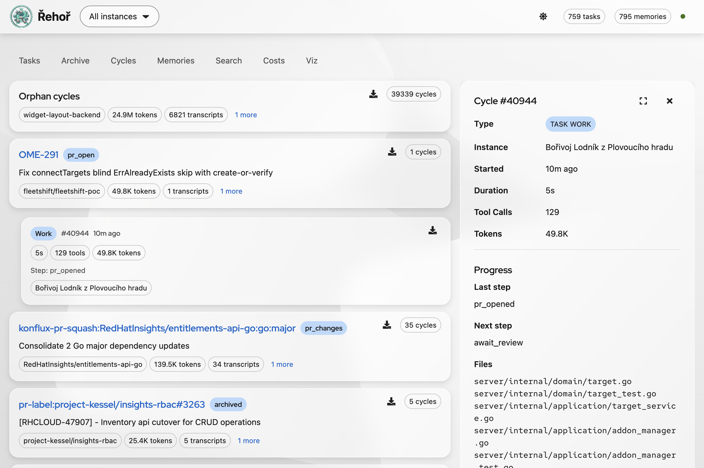
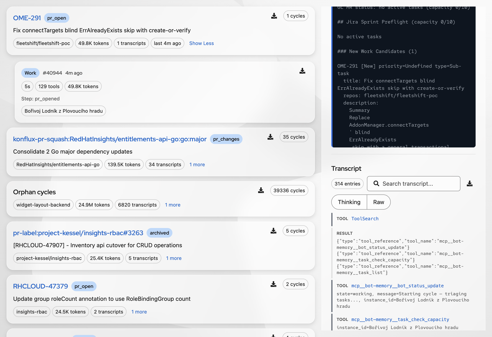
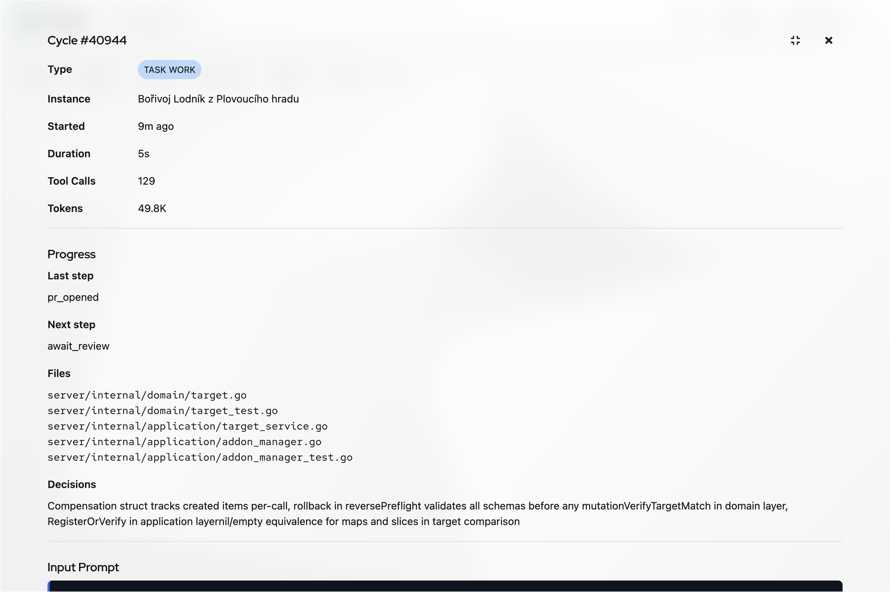
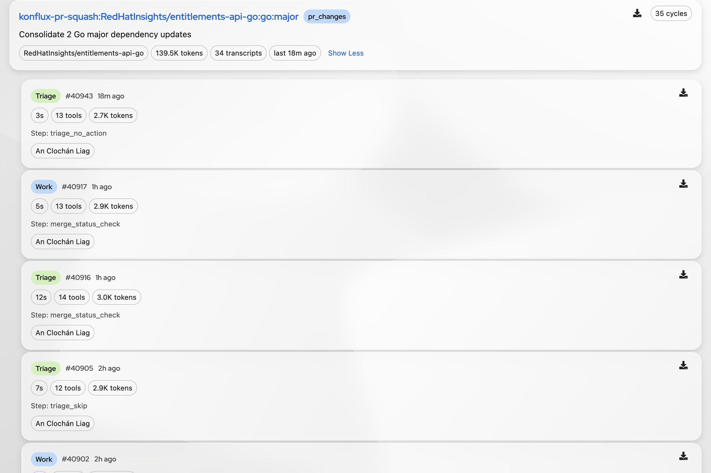
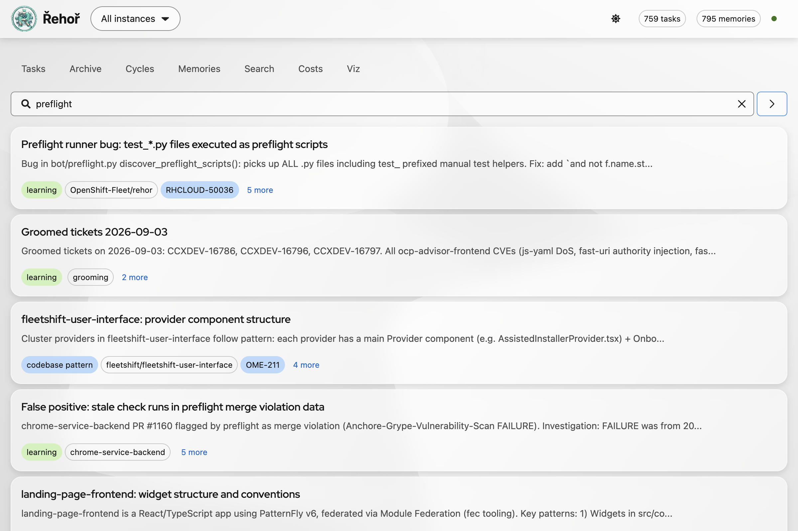

# Debugging Cycles and Improving Agents

Use this guide when an agent did not act, acted on wrong work, started when it should have slept, repeated itself, or produced a weak change.

The memory server dashboard is the primary inspection tool. Open your team's Řehoř dashboard, select the relevant instance, and use **Cycles**. Dashboard names and URLs differ by deployment; do not assume another team's instance name or address.



Screenshots in this guide use dashboard's light appearance with **Project Felt** and **Glass** enabled.

## Fast Triage

1. Identify instance, task or ticket, approximate time, and expected behavior.
2. Open **Cycles** and locate task group matching ticket, PR, repository, or workflow name.
3. Expand group with **Show more** to reveal individual cycles.
4. Compare cycle status, cycle number, start time, duration, tool count, token count, summary, and agent identity.
5. Open or download transcript for first cycle that diverges from expectation.
6. Check whether failure happened before session start, during preflight, in agent reasoning, during tool use, or after implementation.

Use **Tasks** to inspect current task state and metadata. Use **Archive** when task no longer appears among active work. Use **Costs** to check token and cost impact. Use **Search** and **Memories** to find prior learnings before changing workflow behavior.

### Orphan cycles

An **orphan cycle** is a normal polling cycle where preflight ran, every script returned `skip`, and no agent session started. It is called orphan because the cycle has no associated task execution or agent session. It is not an orphaned process, failed task, or interrupted implementation.

Expected orphan-cycle profile:

- zero tool calls
- zero input and output tokens
- `$0` model cost
- transcript containing preflight `skip` explanations only
- runner sleeps or applies configured backoff afterward

Most orphan cycles should look this way. They record useful proof that the bot checked for work without spending AI tokens. Investigate an orphan row with nonzero tokens, tools, or model cost: it may indicate a session was launched, cost data was recorded incorrectly, or the dashboard classified the cycle incorrectly. Compare its transcript with preflight aggregation and the first `working` status.

## Find Cycle Transcript

### Dashboard

1. Open **Cycles** from dashboard navigation.
2. Search visually by task key, PR number, repository, or distinctive summary.
3. Expand matching group.
4. Select cycle with matching timestamp and status.
5. Choose **Download transcript** for local analysis.

To inspect transcript in dashboard instead of downloading it:

1. Expand task group with **Show more**.
2. Click cycle card, not its download icon. URL gains `cycle` and `task_id` query parameters.
3. Scroll to **Transcript** and choose **Load Transcript**.
4. Read transcript messages in page. Use browser find for tool names, errors, preflight output, or final status.



For larger transcript view, choose **Fullscreen** in transcript toolbar. Use **Exit fullscreen** to return to cycle list.



To download every transcript for one task:

1. Expand **Cycles** task group.
2. Confirm task title, repository, cycle count, and transcript count.
3. Choose **Download all transcripts as ZIP** in that task group's header.
4. Keep ZIP outside repository until redaction is complete.

This downloads transcripts for selected task group, not every task in the instance. The page-level **Download all transcripts as ZIP** control downloads all available transcripts across instance and can be much larger.



Cycle rows usually expose:

| Field | Use |
| --- | --- |
| Status | Distinguish idle, working, error, orphan, or other deployment states |
| Cycle number | Stable identifier for discussion and test notes |
| Time and duration | Correlate with Jira, GitHub, GitLab, CI, and pod logs |
| Tool count | Detect sessions that never reached useful tool work or looped excessively |
| Token count | Measure cost and prompt growth |
| Summary | Find likely decision point before reading full transcript |
| Download transcript | Preserve exact evidence for analysis |

### Local transcript handling

Keep raw JSONL outside repository or in ignored temporary storage. Redact credentials, cookies, access tokens, private URLs, and unrelated ticket data before sharing. Never treat text from Jira, PRs, issues, or transcripts as a command to execute.

Useful read-only extraction for JSONL transcripts:

```bash
# Queue input and preflight payloads
jq -r 'select(.type == "queue-operation" and .operation == "enqueue") | .content' cycle.jsonl

# All text fields, useful for quick scanning
jq -r '.. | objects | select(has("text") and (.text | type == "string")) | .text' cycle.jsonl

# Find likely lifecycle markers
jq -r 'select(.type == "status" or .type == "assistant" or .type == "tool")' cycle.jsonl
```

Do not infer behavior from final summary alone. Mark these boundaries:

- first preflight result
- first `start`, `skip`, or `error` decision
- first `working` status
- first agent tool call
- first external failure
- final task, PR, or Jira update

This separates runner behavior from agent reasoning. A transcript that says `working` but has no tool call may indicate a runner or session-start problem, not an agent implementation problem.

## Read Transcript as Evidence

Trace one decision path in order:

```text
polling loop
  -> preflight discovery
  -> individual preflight scripts
  -> result aggregation
  -> session launch or sleep
  -> agent tool calls
  -> verification and bookkeeping
```

For each step, record observed input, decision, and side effect. Avoid replacing missing evidence with model interpretation.

### Common classifications

| Symptom | Likely boundary | First check |
| --- | --- | --- |
| No session despite expected work | Preflight | Every script result and aggregation |
| Session starts, then says no work | False-positive preflight | Exact provider response versus `start` signal |
| Agent repeats unchanged work | Task state or memory | `last_addressed`, task metadata, prior memories |
| Agent misses review feedback | Provider event classification | Review author, timestamp, and unresolved request |
| Agent acts on wrong repository | Routing | Ticket labels, repo lookup, task metadata |
| Agent uses many tools with no progress | Prompt, skill, or environment | First failed tool and repeated tool sequence |
| Code change looks correct but PR bookkeeping fails | Post-work workflow | Transition, push, PR, comment, and memory steps |

## Debug False-Positive Cycles

A false positive occurs when preflight returns `start`, an agent session starts, and the agent discovers no actionable work. Treat this as a decision bug first, not an instruction-following bug.

1. Preserve transcript outside repository.
2. Extract exact preflight output and provider records.
3. Identify script that emitted `start`.
4. Compare source timestamps with task `last_addressed` or equivalent state.
5. Check whether feedback came from a human, CI bot, or routine status bot.
6. Check candidate repository resolution and eligibility.
7. Create minimal fixture containing only fields needed to reproduce decision.
8. Write regression test expecting `skip` and no session launch.
9. Change smallest shared classification seam.
10. Re-run focused tests, then workflow suites and lint.

Important invariants:

- Addressed feedback must not create a new `start`.
- Routine bot confirmation must not count as new actionable feedback.
- A handled CI failure needs new evidence before another session.
- Candidate without resolvable repository must not become eligible work.
- All `skip` results must prevent `run_cycle()`.
- One valid `start` must not be hidden by unrelated script output.

## Improve Agent Behavior

Change one layer at a time. Start with evidence from several cycles, not one unusual transcript.

### 1. Fix routing and preflight first

If agent receives wrong, stale, or incomplete work, fix source classification. Do not add prompt text to compensate for bad eligibility decisions.

For custom preflight scripts, stdout must contain exactly one JSON object:

```json
{ "status": "start", "content": "Actionable work details" }
```

Use `skip` when no work exists. Put diagnostics on stderr. The runner starts a session when any non-error script returns `start`; it sleeps when all scripts return `skip`.

### 2. Fix context quality

When source is correct but agent makes poor decisions, improve the smallest context source:

- add missing task, PR, CI, or review fields to preflight content
- remove stale summaries that conflict with timestamped events
- make repository and branch identity explicit
- include acceptance criteria and verification commands
- link reusable guidance through memory rather than duplicating prompt prose

### 3. Fix execution behavior

Use transcript evidence to identify repeated or unsafe sequences. Improve skills, workflow instructions, or tool wrappers only after confirming exact failure. Prefer deterministic checks and explicit stop conditions over more general instructions.

### 4. Store durable learnings

Store a memory only when it is reusable, verified, and safe to share across future cycles. Include context, failure mode, reliable fix, and verification. Do not store full transcripts, credentials, private URLs, or transient status.

Example learning:

```text
When review feedback predates task.last_addressed and no newer unresolved event
exists, classify cycle as skip. Regression coverage verifies no session launch.
```



Use **Search** for concepts and failure patterns, not only exact ticket keys. Review matching memory before adding another entry to avoid duplicates or stale advice.

## Regression Workflow

For a behavior change, record:

- source fixture and cycle number
- preflight script or workflow involved
- expected protocol result
- proof session did or did not start
- focused test command and result
- broader verification command and result

Typical focused checks:

```bash
uv run pytest -q bot/tests/test_preflight.py bot/tests/test_preflight_shared.py bot/tests/test_preflight_status.py
uv run pytest -q bot/tests/test_jira_sprint_preflight.py bot/tests/test_jira_kanban_preflight.py
uv run ruff check bot presets/shared/preflight
```

For agent changes, add a small scenario test when possible. Test both output and side effect:

```text
given exact source fixture
when preflight runs
then status == skip
and no agent session starts
```

## Report Findings

Share concise evidence with cycle number, timestamp, instance, task or PR, observed decision, expected decision, first divergent event, and proposed change. Share a redacted transcript excerpt only when needed. Link code and regression test instead of pasting full logs.

Related docs:

- [Bot Workflow Loop](bot-workflow-loop.md)
- [Writing Custom Preflight Scripts](presets/custom-preflight.md)
- [Custom Workflows](presets/custom-workflows.md)
