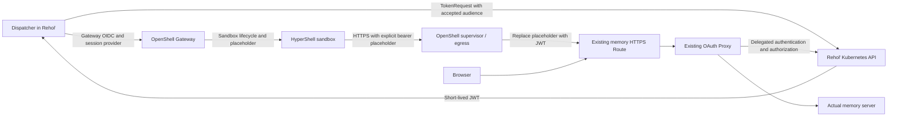

# HyperShell Migration: Integration Requirements

**Status:** Original HyperShell deployment passed authenticated access to actual memory `/health` (`200`). **HYP2/IBM deployment is blocked: sandbox-to-Rehoř access did not succeed.** Proxy integration and full application operations remain pending.

**Tracking:** [REHOR-154](https://redhat.atlassian.net/browse/REHOR-154) (epic), [REHOR-162](https://redhat.atlassian.net/browse/REHOR-162) (spike).

**Goal:** Run short-lived sandboxes in HyperShell, retain Rehoř memory/dashboard and credential-injecting proxies, and keep credentials outside sandboxes. Identify required OpenShift resource and networking changes explicitly.

## What Works and Why

On 2026-09-30, Dispatcher running in Rehoř minted a ServiceAccount JWT through TokenRequest. Its direct fetch preflight and a HyperShell sandbox request used the same token and existing memory Route `/health`; both succeeded. Sandbox returned `{"status":"ok"}` with exit code `0`. Gateway and Dispatcher SDK used OpenShell `0.0.109`.

Two configuration corrections resolved earlier failures:

| Problem | Correction | Why |
|---|---|---|
| JWT requested with audience `https://kubernetes.default.svc` returned `403` at existing OAuth Proxy | Configure the **Rehoř cluster's default API audience** | Existing proxy uses OpenShift delegated bearer authentication. The token must be accepted by its delegated validation path, then pass authorization |
| Plain sandbox curl returned `401` at the earlier authenticated fixture | Explicitly send `Authorization: Bearer $REHOR_MEMORY_TOKEN` | Static provider rewrites a placeholder-bearing header; attaching provider does not create a missing header |

The cluster-default audience is cluster-specific configuration, not universally `https://kubernetes.default.svc`. Discover and verify it against the target cluster rather than assuming a value; issuer and audience are distinct concepts even if their URLs happen to match.

Existing OAuth Proxy already has `--openshift-delegate-urls` and `--openshift-sar` configured. Its current rule checks `list` on `projects`; live authorization check allowed the memory ServiceAccount. Browser OAuth login and delegated bearer authentication are two access modes of the same proxy. **KSA JWT format was not inherently unsupported.** No OAuth token exchange, new memory Route, listener, or middleware was needed for the successful test.

### HYP2 Connectivity Blocker

HYP2 (`0.1.2-rhaiv.0`, SDK `0.1.2`) passed Gateway authentication, Dispatcher TokenRequest/preflight, provider creation, and eventual sandbox readiness. **Remote memory curl did not obtain an HTTP response.** Memory DNS resolved to private Rehoř addresses; local VPN access does not establish IBM/HYP2-to-Rehoř routing. Platform owners must verify private network access/peering or provide an approved reachable authenticated endpoint before adopting HYP2.

Observed direct curl failure was `getpeername() failed with errno 95: Operation not supported`; an explicit local egress-proxy attempt also failed to connect. Runtime/socket compatibility remains a possible contributor, so missing VPN/peering is not yet conclusively isolated. Gateway TLS verification was bypassed only with approval for this disposable test; production needs a trusted, hostname-matching certificate. Gateway URL was supplied through a Secret, not embedded in image/source or lifecycle logs. Test resources were cleaned up.

## Selected Flow

Dispatcher, memory server, and current auth/CLI proxy remain in **Rehoř**; Gateway and sandboxes run in **HyperShell**.



Raw JWT stays in Dispatcher/provider; sandbox environment holds only its placeholder. Shell expands that placeholder, curl sends it, and OpenShell substitutes the real credential before forwarding.

## Dispatcher Configuration and Code Boundary

| Setting | Required value |
|---|---|
| `memory-token-audience` / `AGENT_DISPATCHER_MEMORY_TOKEN_AUDIENCE` | Verified Rehoř cluster-default API audience |
| `memory-health-url` / `AGENT_DISPATCHER_MEMORY_HEALTH_URL` | Existing memory HTTPS Route `/health` |
| `provider-type` | Compatible imported profile for memory host/port/path, bearer header, and curl binary |
| `probe-command-json` / `AGENT_DISPATCHER_COMMAND_JSON` | Structured arguments preserving placeholder expansion and quoted header; example below |
| `AGENT_DISPATCHER_RETAIN_SANDBOX_SECONDS` | `0` normally; positive values deliberately delay cleanup |

```json
["/bin/sh", "-c", "exec /usr/bin/curl -fsS -H \"Authorization: Bearer $REHOR_MEMORY_TOKEN\" \"$1\"", "probe", "https://<existing-memory-route>/health"]
```

Successful retest reused an existing Dispatcher image: it changed requested audience and supplied the above argument array through a temporary Job entrypoint. **No new token minting, provider, memory-server, or OAuth Proxy logic was needed for that retest.** Normal configuration delivery needs the structured-command support added in this branch, because legacy `COMMAND.split(" ")` does not preserve quoted shell arguments. Earlier integer TokenRequest payload and logging fixes were already present in the tested image.

### Audience discovery and automatic token acquisition

Audience is **nonsecret configuration**, not a credential. With an authenticated `oc` context for Rehoř and TokenRequest permission, discover the cluster default without printing the temporary JWT. Do not pass `--audience` in this discovery command:

```bash
oc -n <namespace> create token <memory-service-account> --duration=10m |
  python3 -c '
import base64, json, sys
token = sys.stdin.read().strip()
payload = token.split(".")[1]
claims = json.loads(base64.urlsafe_b64decode(payload + "=" * (-len(payload) % 4)))
audiences = claims["aud"]
for audience in audiences if isinstance(audiences, list) else [audiences]:
    print(audience)
'
```

JWT stays in the pipe and is discarded; output contains only audience(s). Configure the verified accepted value as ConfigMap `memory-token-audience`, mapped to `AGENT_DISPATCHER_MEMORY_TOKEN_AUDIENCE`. Do not put the discovery token in a Secret or reuse it for runs.

Persistent Dispatcher MUST obtain credentials automatically:

1. Kubernetes mounts and rotates Dispatcher pod's projected ServiceAccount API token. Dispatcher MUST reread the mounted token for each TokenRequest.
2. Before each sandbox run, Dispatcher calls `POST /api/v1/namespaces/<namespace>/serviceaccounts/<memory-service-account>/token` with configured audience and lifetime.
3. Dispatcher keeps the returned short-lived session JWT in memory, supplies it to a run-scoped Gateway provider, and deletes that provider at session cleanup.

No manually created session-token Secret or `oc` command is needed at runtime. A Dispatcher Deployment may stay up for months while minting new tokens per run. The separate Gateway client ID/secret still comes from approved Secret/Vault provisioning. Long-running sessions need credential renewal; converting the current one-shot Job into a persistent work loop also remains implementation work.

## Implementation Requirements

Requirements use EARS-style WHEN/WHILE/IF–THEN clauses. Normative terms follow [RFC 2119](https://www.rfc-editor.org/rfc/rfc2119) and [RFC 8174](https://www.rfc-editor.org/rfc/rfc8174). Requirements include work not yet implemented.

**Requirement ID legend:** `D` Dispatcher; `M` memory; `P` HTTP credential-injecting proxy; `Q` forward proxy (Squid or Go); `O` OpenShift resources; `N` networking. The number uniquely identifies a requirement.

### Tokens, Dispatcher, and memory

- **D1:** WHEN a sandbox session starts, Dispatcher MUST mint a fresh short-lived Rehoř ServiceAccount JWT with the receiver-accepted audience and integer `expirationSeconds`, and create a provider dedicated to that session. It MUST record actual returned expiry without logging the token.
- **D2:** Dispatcher MUST use separate Secret-backed Gateway OIDC credentials and a dedicated Kubernetes ServiceAccount for TokenRequest. Gateway credentials, session JWTs, and vendor keys MUST remain separate.
- **D3:** WHEN Dispatcher performs a required connectivity preflight, it MUST call the exact memory endpoint using its freshly minted JWT before creating the provider or sandbox. IF preflight fails, THEN Dispatcher MUST stop that run and MUST NOT claim sandbox authentication succeeded.
- **D4:** Sandbox clients MUST explicitly construct authentication headers with provider placeholders. Dispatcher MUST preserve argument boundaries/quoting. Raw JWTs MUST NOT enter sandbox environment, files, command arguments, images, ConfigMaps, logs, or Git.
- **D5:** WHILE a run exceeds token or Gateway access-token lifetime, Dispatcher MUST refresh before expiry or stop at a controlled boundary. Live provider refresh semantics MUST be tested before relying on them.
- **D6:** WHEN execution ends or is cancelled, Dispatcher MUST attempt sandbox/provider deletion. Reconciliation MUST handle crashes/orphans. Provider deletion does not revoke issued JWTs; per-session revocation requires expiry or receiver-side session enforcement.
- **M1:** Memory access MUST reuse existing OAuth Route and delegated bearer authentication with a verified accepted audience. Browser login MUST remain operational. Receiver MUST enforce authorization, not merely accept any authenticated ServiceAccount.
- **M2:** Distinct JWTs/providers from one ServiceAccount MUST NOT be treated as distinct per-sandbox identities. IF per-run permissions are required, THEN an additional session authorization mechanism MUST be implemented.

### HTTP credential-injecting proxy (next workstream)

Preferred simple flow: sandbox sends session placeholder in `Authorization` → OpenShell replaces it with JWT → OAuth Proxy authenticates/authorizes it → Rehoř HTTP auth/CLI proxy removes session Authorization and injects vendor-specific credentials → calls vendor. Sandbox supplies no vendor credential. Header stripping/injection through this gated proxy is **not yet E2E-tested**.

- **P1:** WHEN a sandbox calls the HTTP credential-injecting proxy, proxy MUST validate the session token before forwarding, remove the session header, and inject its proxy-owned upstream credential. The session token MUST NOT reach vendors or redirected destinations.
- **P2:** Proxy MUST replace/discard client-supplied vendor credentials where its endpoint contract requires proxy-owned authentication. Long-lived vendor keys MUST remain inside existing Secret/Vault boundary.
- **P3:** Session Authorization MUST be removed on every forwarding path, including when vendor uses a different header such as `x-api-key`. Optional token-forwarding headers MUST NOT leak session credentials upstream. The deployed OAuth Proxy has no supported setting to authenticate a custom JWT header; such a design would require a separate adapter/validator and its own E2E.
- **P4:** IF receiver uses TokenReview, THEN it MUST call the Rehoř API with its own projected API token/CA, explicitly validate session audience, authorize returned identity, and fail closed when validation is unavailable. A receiver in another cluster requires explicit trust/broker configuration.
- **Q1:** Forward proxy MUST preserve allowlisting and unintercepted TLS tunneling. Session credentials MUST NOT be added to destination headers on that path. HTTPS CONNECT conceals destination headers; tunnel authentication MUST use separate proxy-auth handling.

### Optional Go Forward Proxy

If Squid's authentication integration is cumbersome, a small Go forward proxy is a candidate replacement, not a committed migration:

```text
Sandbox --Proxy-Authorization: Bearer <session JWT>--> Go proxy
Go proxy validates JWT + destination allowlist, then consumes proxy credential
HTTPS: establish CONNECT tunnel; relay encrypted bytes without TLS interception
HTTP: forward request without proxy/session authentication headers
```

- **Q2:** Proxy MUST authenticate before opening an upstream connection and MUST NOT forward `Proxy-Authorization` or other session headers to destinations. It MUST preserve legitimate destination authentication separately.
- **Q3:** Proxy MUST enforce destination host/port and resolved-IP restrictions, TLS protection on the client-to-proxy hop, connection/time limits, streaming cleanup, and deny unauthorized destinations. A generic open CONNECT relay is not acceptable.

Go cannot strip headers inside encrypted HTTPS any more than Squid can. Session token therefore belongs only on the outer proxy request. Credential-injecting HTTP endpoints remain a separate path. Before choosing Go, test Squid proxy-auth feasibility, actual client support, OpenShell credential delivery for CONNECT, and ingress transport support; memory OAuth Route E2E proves none of these. No replacement or existing deployment change is needed until that isolated test passes.

## Required OpenShift Resources and Networking

| Area | Required action |
|---|---|
| Memory/dashboard | **No new Route, listener, Service port, NetworkPolicy, or auth middleware required for verified `/health` flow.** Preserve existing OAuth Proxy and delegated RBAC |
| Dispatcher | Promote compatible tested image; provide accepted audience, existing URL, structured header command, Gateway Secret, and scoped provider/policy |
| TokenRequest RBAC | Preserve namespace Role granting only `create` on `serviceaccounts/token` for intended `resourceNames`, bound to Dispatcher SA |
| HTTP auth/CLI proxy | Determine authenticated cross-cluster HTTP entry point and session validation/header stripping; existing ClusterIP is not externally reachable |
| Forward proxy | Validate authenticated CONNECT with Squid or optional Go fixture and suitable TLS ingress; do not assume existing OAuth Route supports it |
| Networking | HTTPS/DNS and scoped OpenShell egress to memory/proxy host; router ingress only to protected listeners; API access for Dispatcher/delegated reviewers |

- **O1:** App-interface changes MUST follow current resource ownership patterns and tested template/image references. Namespace-managed resources need `openshiftResources` and appropriate namespace `managedResourceTypes`/`managedResourceNames`; SaaS resources use corresponding deployment ownership. Check existing grants before adding roles.
- **N1:** Provider/policy MUST scope egress and rewriting to intended host, port, path, and binary. ClusterIPs and foreign-cluster namespace selectors MUST NOT be assumed to provide cross-cluster routing/access control.
- **N2:** NetworkPolicies MUST be reviewed together because allowed traffic is additive. New test resources MUST use uniquely named resources and isolated selectors; existing deployments MUST NOT be patched for fixture tests. Temporary path Routes MUST be removed after testing.
- **N3:** WHEN selecting a different HyperShell cluster, sandbox-to-Rehoř DNS, TCP/TLS reachability, and authenticated HTTP access MUST be tested from that cluster. Dispatcher-side preflight or local VPN access MUST NOT be treated as proof of sandbox connectivity.

No ingress source-IP allowlist or networking changes were needed for existing memory Route test. New proxy exposure still requires its own design and protocol-specific validation.

## Next Acceptance Steps

1. Deliver successful command through normal JSON configuration and promoted Dispatcher image. Validate intended memory MCP/API operations, invalid/expired/wrong-identity tokens, and browser login; health `200` alone does not prove feature parity.
2. Test OAuth-gated HTTP proxy fixture using session Authorization: authenticated request succeeds, invalid requests fail, upstream sees dummy vendor credential and **never** session JWT; include vendors using different auth headers, redirects, and streams.
3. Test authenticated CONNECT with Squid or Go fixture: validate proxy credentials, allowlist denials, client/OpenShell/ingress compatibility, and no session-token leakage. Validate actual HTTP proxy listeners and separately decide executor/gRPC authentication.
4. Define TTL, renewal, per-session authorization/revocation, and crash cleanup; test long runs.
5. Cross-reference current app-interface resources/RBAC, then apply only remaining necessary permanent changes. Separate memory machine endpoint is a fallback only if future endpoint authorization requirements demand it.
